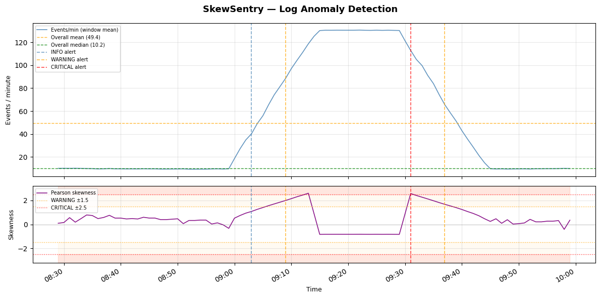

# SkewSentry
A command-line log anomaly detector that uses **Pearson's coefficient of skewness** to identify brute-force attacks and slow exfiltration in Apache/Nginx access logs and SSH auth.log files — no machine learning, no signatures, pure statistics.

---

## What is SkewSentry

SkewSentry applies a sliding window over time-bucketed log event counts and computes skewness on each window. A sudden spike in failed logins shifts the distribution right (positive skew); a covert low-rate exfiltration suppresses normal traffic and shifts it left (negative skew). When skewness crosses a configurable threshold, an alert fires.

---

## The Math: Pearson's Coefficient of Skewness

SkewSentry implements two variants:

**Pearson's second skewness coefficient (median method)** — primary detector:sk = 3 * (mean - median) / std
Used for all alert classification. Robust against multi-modal distributions and does not require a mode estimate.

**Fisher's moment-based skewness** — computed for comparison only: sk = E[(X - μ)³] / σ³
Both are computed per window. Alerts are based on the Pearson median method.

**Thresholds:**

| Severity | |sk| ≥ | Interpretation |
|----------|-----------|----------------|
| INFO     | 1.0       | Notable deviation |
| WARNING  | 1.5       | Probable attack pattern |
| CRITICAL | 2.5       | High-confidence anomaly |

**Important bound:** Pearson's median skewness is theoretically bounded between -3 and +3. In practice, with realistic window sizes (30–60 buckets), a single-event spike rarely exceeds ±1.0. Sustained anomalous traffic across multiple consecutive buckets is required to cross the WARNING threshold — this is intentional and reduces false positives.

---

## Installation

```bash
git clone https://github.com/sajid-sec/Skewsentry.git
cd Skewsentry
python3 -m venv .venv
source .venv/bin/activate
pip install -r requirements.txt
```

**Requirements:** Python 3.10+, numpy, pandas, scipy, matplotlib, colorama, rich

---

## Usage

```bash
# Analyze SSH auth.log
python3 skewsentry.py /var/log/auth.log --format ssh

# Analyze Apache access log with custom window and threshold
python3 skewsentry.py access.log --format apache --window 30 --threshold 1.5

# Auto-detect format, output JSON for SIEM integration
python3 skewsentry.py access.log --output json --outfile alerts.json

# Generate matplotlib chart
python3 skewsentry.py access.log --format apache --window 30 --plot

# Generate synthetic attack sample for testing
python3 skewsentry.py --generate-sample --attack brute_force --outfile demo.csv
python3 skewsentry.py --generate-sample --attack slow_exfiltration --outfile demo_exfil.csv

# Run on synthetic sample with verbose window output
python3 skewsentry.py demo.csv --format csv --window 30 --verbose
```

**All flags:**

| Flag | Default | Description |
|------|---------|-------------|
| `--format` | auto | Log format: apache, ssh, csv, auto |
| `--window` | 60 | Sliding window size in minutes |
| `--step` | 1 | Window step size in minutes |
| `--threshold` | 1.5 | Skewness threshold for WARNING alerts |
| `--output` | terminal | Output format: terminal, json, csv |
| `--outfile` | — | Output file path |
| `--plot` | off | Save matplotlib chart as PNG |
| `--verbose` | off | Print every window, not just alerts |
| `--generate-sample` | — | Generate synthetic log file |
| `--attack` | brute_force | Attack type for sample generator |

---

## Sample Output

### Terminal (brute force detection on 120-minute synthetic log)
[] Parsing: demo_brute.csv  (format=csv)
[] Parsed 4702 events.
[*] Analyzed 91 windows. Running alert classifier (threshold=1.5)...
⚠  Anomalies Detected
Timestamp             Severity         Type               Skewness
2024-01-15 09:03:00   [!  ] INFO       VOLUMETRIC_SPIKE   +1.0890
2024-01-15 09:09:00   [!! ] WARNING    BRUTE_FORCE        +1.9612
2024-01-15 09:31:00   [!!!] CRITICAL   BRUTE_FORCE        +2.5310
2024-01-15 09:37:00   [!! ] WARNING    BRUTE_FORCE        +1.6712
SkewSentry Summary
Windows analyzed  : 91
Total alerts      : 4
Critical : 1   Warning : 2   Info : 1
Brute Force : 3   Slow Exfil : 0
Max |skewness|    : 2.5388
### Chart



Top panel: event counts per minute with overall mean/median lines and alert markers.
Bottom panel: Pearson skewness over time with WARNING (±1.5) and CRITICAL (±2.5) threshold lines.

### JSON output schema

```json
{
  "schema_version": "1.0",
  "summary": {
    "total_windows_analyzed": 91,
    "total_alerts": 4,
    "critical": 1,
    "warning": 2,
    "info": 1,
    "brute_force": 3,
    "slow_exfiltration": 0,
    "max_skewness": 2.538800,
    "analysis_duration_seconds": 0.412
  },
  "alerts": [
    {
      "timestamp": "2024-01-15T09:31:00",
      "severity": "CRITICAL",
      "alert_type": "BRUTE_FORCE",
      "skewness": 2.531015,
      "mean": 110.2,
      "median": 14.5,
      "std": 113.4327,
      "n": 30
    }
  ]
}
```

---

## Real Data Testing

Tested on live SSH auth.log from an Ubuntu 22.04 machine. After generating 50 failed login attempts against localhost, SkewSentry correctly identified a **BRUTE_FORCE WARNING** (skewness +0.6547) in the SSH event stream. The lower skewness value (vs synthetic data) reflects the short burst duration — a sustained multi-minute brute force would produce higher skewness.
[] Parsed 18 events from /var/log/auth.log
[] Analyzed 1 windows. Running alert classifier (threshold=0.5)...
BRUTE_FORCE   WARNING   sk=+0.6547   2026-06-06 17:37:00
---

## Project Structure
skewsentry/
├── skewsentry.py      # CLI entry point
├── analyzer.py        # Pearson + Fisher skewness math
├── parser.py          # Apache / SSH / CSV log parsers
├── window.py          # Sliding window engine (collections.deque)
├── alerter.py         # Alert classification + cooldown
├── reporter.py        # Rich terminal output
├── visualizer.py      # Matplotlib two-panel chart
├── tests/
│   ├── test_analyzer.py      # Unit tests: skewness math
│   ├── test_parser.py        # Unit tests: log parsers
│   ├── test_window.py        # Unit tests: window engine
│   ├── test_alerter.py       # Unit tests: alert logic
│   └── test_integration.py   # Ground truth: attack injection tests
├── sample_logs/
├── requirements.txt
└── README.md
**Test coverage:** 68 tests, 0 failures across all modules and integration scenarios.

---

## Limitations & Future Work

**Current limitations:**

- **Pearson skewness is bounded and can saturate.** Values are constrained to roughly ±3. Extremely high-volume attacks (10,000+ events/min) may produce the same skewness as moderate attacks (200 events/min) — the formula cannot distinguish them.
- **Pearson mode method is unreliable on noisy/continuous data.** SkewSentry uses the median variant for all alerts; the mode variant is computed but not used for classification because mode is unstable on non-discrete distributions.
- **No baseline learning.** The detector uses a fixed threshold, not a learned normal profile. A legitimate traffic spike (flash crowd, software update) will trigger the same alert as a brute force attack.
- **Single-metric detection.** Only skewness is used. Inter-arrival time, source IP diversity, and payload size are not considered — all of which a real IDS would incorporate.
- **No machine learning comparison.** There is no benchmark against isolation forest, LSTM, or other anomaly detection approaches. Skewness is faster and more interpretable, but whether it has higher precision/recall on real datasets is untested.
- **Window size is fixed.** Attacks shorter than one window size may not generate enough skewness to cross the threshold.

**Planned improvements:**

- Adaptive threshold based on rolling baseline statistics
- Multi-metric scoring (skewness + entropy + rate-of-change)
- Real-time tail mode (`--tail /var/log/auth.log`) using `watchdog`
- CICIDS2017 dataset validation for precision/recall benchmarking

---

## References

- Pearson, K. (1895). *Contributions to the Mathematical Theory of Evolution*. Philosophical Transactions of the Royal Society.
- NIST SP 800-94: *Guide to Intrusion Detection and Prevention Systems*
- CICIDS2017 Dataset: Sharafaldin, I., Lashkari, A. H., & Ghorbani, A. A. (2018). *Toward Generating a New Intrusion Detection Dataset and Intrusion Traffic Characterization*. University of New Brunswick.
- Python `scipy.stats.skew` documentation: https://docs.scipy.org/doc/scipy/reference/generated/scipy.stats.skew.html
